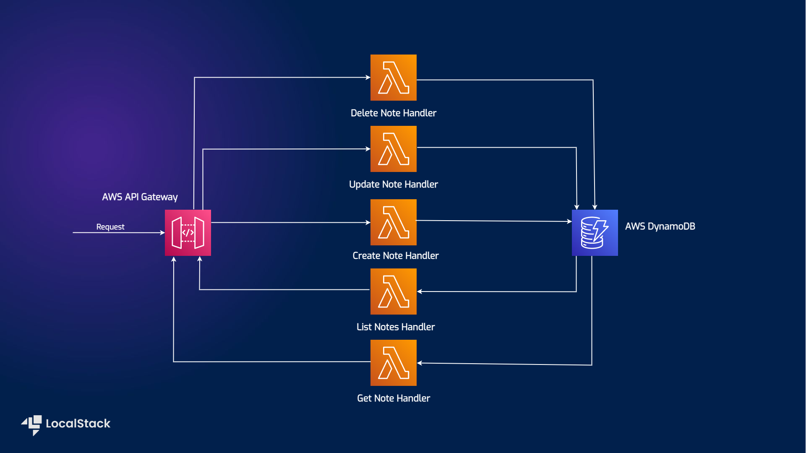

# Note-Taking application using AWS SDK for JavaScript, Amazon DynamoDB, Lambda, API Gateway

| Key          | Value                                                                                                                                                                                                                                                                                                                                                                                                                                                                                                                                                                                                                                                                                                                                                                                                                                                                                                                                                                                                                                                                                                                                                                                                                                                                                                                                                                          |
| ------------ | ------------------------------------------------------------------------------------------------------------------------------------------------------------------------------------------------------------------------------------------------------------------------------------------------------------------------------------------------------------------------------------------------------------------------------------------------------------------------------------------------------------------------------------------------------------------------------------------------------------------------------------------------------------------------------------------------------------------------------------------------------------------------------------------------------------------------------------------------------------------------------------------------------------------------------------------------------------------------------------------------------------------------------------------------------------------------------------------------------------------------------------------------------------------------------------------------------------------------------------------------------------------------------------------------------------------------------------------------------------------------------ |
| Environment  |   |
| Services     | DynamoDB, Lambda, API Gateway, S3                                                                                                                                                                                                                                                                                                                                                                                                                                                                                                                                                                                                                                                                                                                                                                                                                                                                                                                                                                                                                                                                                                                                                                                                                                                                                                                                |
| Integrations | CDK, AWS SDK for JavaScript                                                                                                                                                                                                                                                                                                                                                                                                                                                                                                                                                                                                                                                                                                                                                                                                                                                                                                                                                                                                                                                                                                                                                                                                                                                                                                                                                    |
| Categories   | Serverless                                                                                                                                                                                                                                                                                                                                                                                                                                                                                                                                                                                                                                                                                                                                                                                                                                                                                                                                                                                                                                                                                                                                                                                                                                                                                                                                                                    |


## Architecture diagram

The following diagram shows the architecture that this sample application builds and deploys:



We are using the following AWS services and their features to build our infrastructure:

- [DynamoDB](https://docs.localstack.cloud/user-guide/aws/dynamodb/) as a key-value & document database to perform create, delete, get, list and update operations on the user notes.
- [Lambda](https://docs.localstack.cloud/user-guide/aws/lambda/) to create the serverless functions to create, list, update, delete, and get all the user notes.
- [API Gateway](https://docs.localstack.cloud/user-guide/aws/apigatewayv2/) to expose the Lambda functions to the user through HTTP APIs.


### Prerequisites

- **Python**
- **Docker**: Required for running LocalStack.
- **Yarn**: Used for managing frontend and backend dependencies.
- **LocalStack** [`localstack` CLI](https://docs.localstack.cloud/getting-started/installation/#localstack-cli).
- **[AWS CLI]**(https://docs.localstack.cloud/user-guide/integrations/aws-cli/) with the [`awslocal` wrapper](https://docs.localstack.cloud/user-guide/integrations/aws-cli/#localstack-aws-cli-awslocal).
- **[CDK]**(https://docs.localstack.cloud/user-guide/integrations/aws-cdk/) with the [`cdklocal`](https://www.npmjs.com/package/aws-cdk-local) wrapper.
- [Node.js](https://nodejs.org/en/download/) with `yarn` package manager.


#### Virtual Environment Management

- **Creating the Virtual Environment**:
  
  - The virtual environment directory is specified as `.venv`.
  
  - To create the virtual environment and install dependencies:
    ```bash
    python -m venv .venv
    ```

  - Activate the virtual environment:
    ```bash
    source .venv/bin/activate
    ```
    Or
    ```bash
    . .venv/bin/activate
    ```

  - Install required dependancies:
    ```bash
    pip install -r requirements.txt
    ```

  - Start local stack in detached mode
    ```bash
    localstack start -d
    ```

- **Run the targets in the Makefile**

    #### Combined Command

    - **Good Candidate**:
    - Executes build, bootstrap, and deploy commands in sequence:
        ```bash
        make good_candidate
        ```
At the end you are expected to see the following output:

```shell
  ➜  Local:   http://localhost:5173/
  ➜  Network: use --host to expose
  ➜  press h + enter 
```
Now navigate to the link in your browser and test the application that has been deployed using aws resources on localstack.


### Break down of what is in the Makefile
#### LocalStack Management

- **Start LocalStack**:
  - To run LocalStack in detached mode:
    ```bash
    make localstack_start
    ```
  - This command checks for the LocalStack Docker container and starts it if not running.

- **Stop LocalStack**:
  - To stop LocalStack:
    ```bash
    make localstack_stop
    ```

#### Infrastructure and Backend

- **Build the Backend**:
  - To build the backend using Yarn:
    ```bash
    make build
    ```

You are expected to see the following output:

```shell
  dist/updateNote/app.js  186.5kb
  dist/createNote/app.js  186.2kb
  dist/deleteNote/app.js  186.0kb
  dist/getNote/app.js     184.0kb
  dist/listNotes/app.js   182.5kb

Done in 0.33s.
```

- **Bootstrap Infrastructure**:
  - Set up the infrastructure resources using `cdklocal` (a LocalStack CDK wrapper):
```bash
make bootstrap
```

You are expected to see the following output:
```bash
     ⏳  Bootstrapping environment aws://000000000000/us-east-1...
Trusted accounts for deployment: (none)
Trusted accounts for lookup: (none)
Using default execution policy of 'arn:aws:iam::aws:policy/AdministratorAccess'. Pass '--cloudformation-execution-policies' to customize.
 ✅  Environment aws://000000000000/us-east-1 bootstrapped (no changes).
Done in 18.25s.
```

- **Deploy Infrastructure**:
  - Deploy the infrastructure resources to LocalStack:
```bash
make deploy
```
> If you see a `CREATE_FAILED (Deployment failed)` error, wait a few seconds and re-run the command.

You are expected to see the following output:

```shell
     ✅  AwsSdkJsAppStack-5

✨  Deployment time: 35.49s

Outputs:
AwsSdkJsAppStack-5.GatewayUrl = https://0zcjsv8puv.execute-api.localhost.localstack.cloud:4566/prod/
AwsSdkJsAppStack-5.Region = us-east-1
AwsSdkJsAppStack-5.endpointEndpoint5E1E9134 = https://0zcjsv8puv.execute-api.localhost.localstack.cloud:4566/prod/
Stack ARN:
arn:aws:cloudformation:us-east-1:000000000000:stack/AwsSdkJsAppStack-5/0f12d6e1

✨  Total time: 36.18s

Done in 56.71s.
```  

#### Frontend Management

- **Run the Frontend**:
  - Start the frontend development server:
    ```bash
    make run_frontend
    ```


### Additional Information

- **Docker for LocalStack**: If LocalStack is not present, it will be pulled from Docker. The `localstack/localstack` image is required to use this setup.
- **CORS Configuration**: By setting `EXTRA_CORS_ALLOWED_ORIGINS` to `*`, CORS requests from all origins are allowed, which is beneficial during development.

### Example Usage

1. **Initialize the environment**:
   ```bash
   make install-dependencies
   ```

2. **Start LocalStack and deploy infrastructure**:
   ```bash
   make localstack_start
   make good_candidate
   ```

3. **Run the frontend**:
   ```bash
   make run_frontend
   ```

4. **Stop LocalStack when done**:
   ```bash
   make localstack_stop
   ```

5. **Clean Up**:
  - To remove the virtual environment:
    ```bash
    make clean
    ```